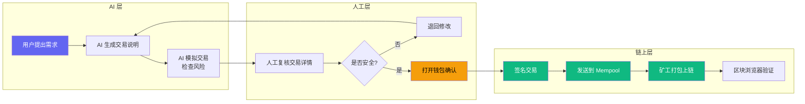
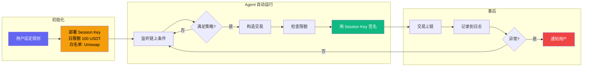
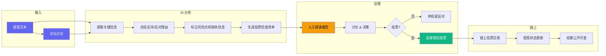

# AI x Web3 最小交叉流程图

---

## 工作流 A：AI 生成交易 -> 人工确认 -> 链上执行



| 角色 | 步骤 | 说明 |
|------|------|------|
| 用户发起 | 提出需求 | "帮我看这笔 approve 能不能签" |
| AI 执行 | 生成说明 + 模拟 | 链上查 spender、余额、模拟交易 |
| 人工确认 | **复核 + 决策** | 必须人工判断是否可信 |
| 钱包签名 | **签名** | 必须用户亲手在 MetaMask 签名 |
| 链上执行 | 交易上链 | AI 可后续读取交易收据验证 |

---

## 工作流 B：Agent 自动化 -> 人工兜底



| 角色 | 步骤 | 说明 |
|------|------|------|
| 用户 | 设定规则 | **一次性授权**：部署 Session Key |
| Agent | 全自动执行 | 在限额内自动构造并签名交易 |
| 链上 | 交易上链 | Session Key 权限受限于预设规则 |
| 用户 | 事后监督 | 检查日志，发现异常可撤销 Session Key |

---

## 工作流 C：DAO 治理助手



| 角色 | 步骤 | 说明 |
|------|------|------|
| 提案人 | 发起提案 | 提交文本 |
| AI | 分析整理 | 读提案 + 论坛，生成报告 |
| 社区 | **阅读 + 讨论** | AI 辅助但不能替人投票 |
| 投票人 | **钱包签名** | 投票交易需要钱包确认 |
| 链上 | 记录结果 | 提案状态、票数公开可查 |

---

## 三条流程的边界对比

```
                       流程 A                   流程 B                   流程 C
                   (授权检查助手)          (Agent 自动交易)         (DAO 治理助手)

AI 自动化程度      中                       高                       低-中
人工介入点        每笔交易确认             事前设定规则              每次投票决策
签名方式          用户手动签名             Session Key 自动签        用户手动签名
风险场景          用户无视警告签名         Session Key 被盗用        AI 遗漏关键信息
适用场景          高频、高风险决策         低频、规则明确的交易       信息筛选 + 决策辅助
```

## 关键原则

```
AI 不能做的：
  - 接触私钥 / 助记词
  - 替用户签名
  - 自动发送链上交易（除非 Session Key）
  - 替用户做最终决策

AI 可以做的：
  - 读取链上公开数据
  - 生成交易解释和风险分析
  - 模拟交易结果
  - 在预设限额内自动执行（Session Key）
  - 记录和追踪交易状态
```
